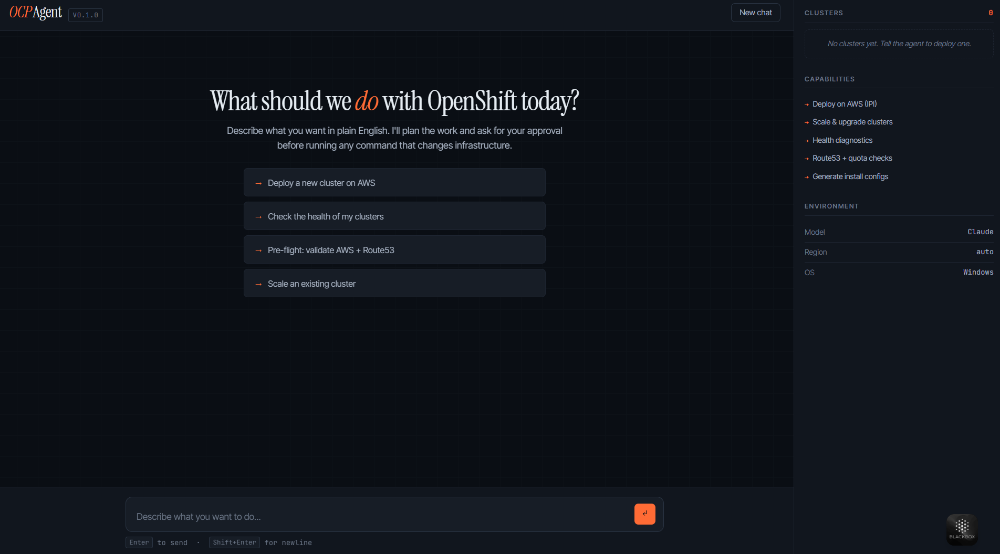
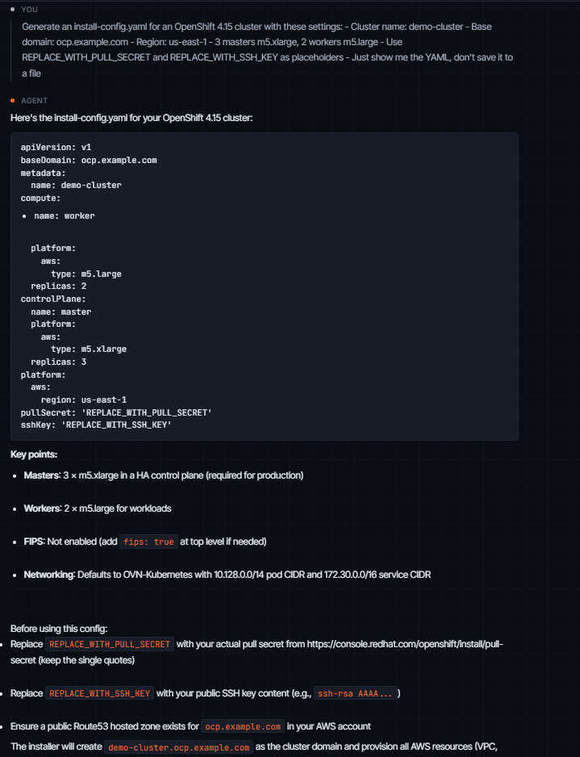
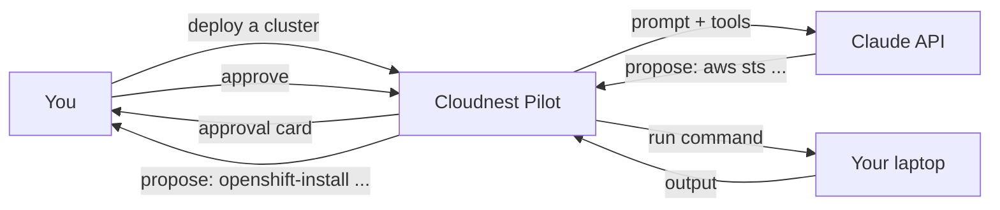
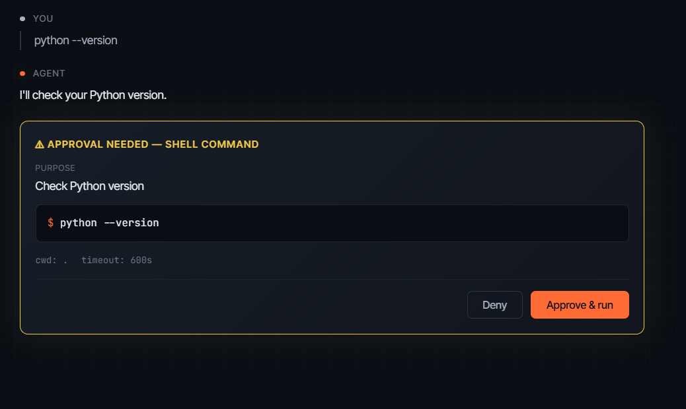
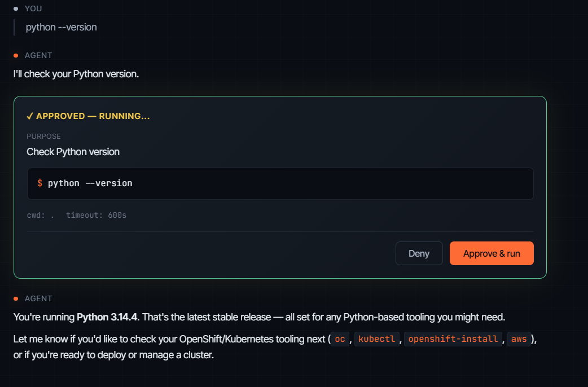

<div align="center">

# 🛩 Cloudnest Pilot

**AI copilot for deploying and managing OpenShift clusters.**

Tell it what you want in plain English. It plans the work, writes the configs,
and runs the deployment — asking for your approval before every change.

[](https://pypi.org/project/cloudnest-pilot/)
[](LICENSE)
[](https://github.com/cloudnestinfoworks/cloudnest-pilot/actions/workflows/test.yml)
[](https://github.com/cloudnestinfoworks/cloudnest-pilot/discussions)

</div>

---

## What is this?

Cloudnest Pilot is a local CLI + web app that turns OpenShift cluster
operations into a conversation. It uses Claude (via your own API key) to
plan deployments, generate `install-config.yaml` and IAM policies, run
`openshift-install`, scale workers, troubleshoot operators, and more.

It's the difference between:

```bash
$ openshift-install create cluster --dir=./cluster1
INFO Credentials loaded from default AWS environment variables
INFO Consuming Install Config from target directory
ERROR Some unhelpful 200-line stack trace
```

And:

```bash
$ cloudnest-pilot
> Deploy a 3-master, 2-worker cluster on AWS ap-south-1, 
  base domain ocp.example.com, name "production-east"

The agent walks you through the plan, validates AWS prerequisites,
generates install-config.yaml, asks you to approve the install command,
streams installation progress, and verifies cluster health.
Total clicks: 3.  Total time you spent thinking about it: 5 minutes.
```

## Quick demo

<p align="center">
  
</p>

<p align="center"><sub>Cloudnest Pilot's web UI on first launch — type what you want to do, the agent plans the work.</sub></p>

## Why this exists

Here's the truth: I've deployed 100+ OpenShift clusters across my career.
You'd think after the first 20 it would be muscle memory. It's not. Every
single deploy, I miss one tiny step — a pull secret that rotated, a Route53
zone in the wrong format, a single IAM permission I forgot. And every time,
I learn the same lesson at 11pm: the difference between a smooth install
and an hour of debugging is one checkbox I forgot to tick.

The deploy that broke me was a production cluster for a financial services
client. Bootstrap timeout. Three hours of digging through CloudFormation
events, OpenShift installer logs, and EC2 console. Root cause? A NAT gateway
in the wrong subnet, blocking the bootstrap node from reaching the cluster
mirror. I'd seen this exact failure twice before — once in a dev cluster,
once during a workshop. My brain stored it as "weird one-off." It wasn't.
It was a pattern I kept rediscovering because nothing wrote it down.

That's when I decided: my memory isn't the right place to store deployment
knowledge. Code is.

Cloudnest Pilot is the agent I wish I'd had on every one of those 100
deploys. You tell it what kind of cluster you need. It walks through the
same checks I'd walk through if I were paying attention. It generates the
same configs I'd generate if I weren't tired. It catches the same gotchas
I'd catch if it were 10am instead of 10pm.

The result you should feel: every cluster you deploy looks like the careful,
standardized work of a senior architect on their best day — not the rushed
work of a tired engineer late on a Friday.

If you've shipped more than a handful of OpenShift clusters, you already
know what I'm talking about. Try it.

## Install

### From PyPI (recommended)

```bash
pip install cloudnest-pilot
```

### From source

```bash
git clone https://github.com/cloudnestinfoworks/cloudnest-pilot.git
cd cloudnest-pilot
pip install -e .
```

### With Docker

```bash
docker run -p 8765:8765 \
  -e ANTHROPIC_API_KEY=sk-ant-... \
  -v ~/.aws:/root/.aws:ro \
  ghcr.io/cloudnestinfoworks/cloudnest-pilot:latest
```

## Get an API key

Cloudnest Pilot uses Claude AI under the hood. Get an Anthropic API key:

1. Visit https://console.anthropic.com/settings/keys
2. Create a key (starts with `sk-ant-api03-...`)
3. **Set a spending cap** at https://console.anthropic.com/settings/limits
   (recommended: $20/month — typical usage is $3-5/month)

You bring your own API key — Cloudnest Pilot never proxies your conversations
through any server we control.

## Usage

### Web UI (recommended for first run)

```bash
cloudnest-pilot --web
```

Then open http://localhost:8765 in your browser.

### Command line

```bash
cloudnest-pilot --cli
```

Talk to the agent in your terminal with rich-formatted output.

### Demo mode (no API key needed)

```bash
cloudnest-pilot --demo
```

Try the UI with canned responses — useful for showing colleagues what the
tool does before they invest in setup.

## What it can do today

> **v0.1.0 — alpha release.** Cloudnest Pilot is in active development.
> Features below work in our testing, but expect rough edges. Every shell
> command requires your approval, so the worst case is "deny something
> unexpected and try again."

<p align="center">
  
</p>

<p align="center"><sub>The agent generates production-shaped <code>install-config.yaml</code> from a plain-English request.</sub></p>

| Capability | Status |
|---|---|
| Deploy on AWS via IPI | 🧪 Alpha |
| Generate install-config.yaml from prompts | 🧪 Alpha |
| Generate AWS IAM policies for the installer | 🧪 Alpha |
| Validate AWS credentials, region, Route53 zones | 🧪 Alpha |
| Read cluster health (`oc get co`, nodes, pods) | 🧪 Alpha |
| Troubleshoot install failures conversationally | 🧪 Alpha |
| Azure ARO support | 📋 Roadmap |
| GCP OSD support | 📋 Roadmap |
| On-prem (vSphere, bare metal, UPI) | 💭 Considering |
| Multi-cluster fleet management | 💭 Considering |

Our path to v1.0:
1. Polish AWS deployment based on early-user feedback (now)
2. Internal QA with real production-grade clusters
3. Add Azure ARO (next major release)
4. Mark `Stable` once we've got dozens of successful real deployments

## How it works



Every shell command requires explicit approval. No autonomous mayhem.

The agent uses [Anthropic's tool-use API](https://docs.anthropic.com/en/docs/build-with-claude/tool-use)
under the hood. The system prompt encodes OpenShift IPI knowledge. The
tools (`run_shell`, `read_file`, `write_file`, `check_aws`) are simple
Python functions decorated to register with the agent.

See [docs/ARCHITECTURE.md](docs/ARCHITECTURE.md) for details.

## Safety model

| Tool | Auto-runs? | Why |
|---|---|---|
| `read_file` | Yes | Read-only |
| `check_aws` | Yes | Read-only API calls |
| `list_clusters` | Yes | Filesystem scan only |
| `get_cluster_status` | Yes | Read-only `oc get` commands |
| `run_shell` | **No — always asks** | Could run anything |
| `write_file` | **No — always asks** | Could overwrite |

### Hard-coded command blocklist

Even if you click "Approve" on a destructive command, the tool refuses to
run these patterns:

- `rm -rf /` and `rm -rf /*`
- Fork bombs: `:(){ :|:& };:`
- Filesystem wipes: `mkfs.*`, `dd if=/dev/zero of=/dev/`, `> /dev/sda`
- Reckless permissions: `chmod -R 777 /`

See [`tools/shell.py`](tools/shell.py) for the exact list. The blocklist is
intentionally narrow — it's a backstop for misclicks, not a comprehensive
sandbox. The real safety boundary is your approval click.

### Audit trail

Every command run is logged to `~/.cloudnest-pilot/history.log` with
timestamps. If something unexpected happens, you have a record.

### What approval looks like

When the agent wants to run a shell command or write a file, it shows you
an approval card with the exact action and asks for your call:

<p align="center">
  
</p>

If you click **Approve & run**, the action executes and the result is
returned to the conversation:

<p align="center">
  
</p>

## Pricing

**Cloudnest Pilot is free and open source.** Apache 2.0 license, no telemetry,
no usage caps, no "free tier" with hidden limits.

Your only cost is Claude API usage, billed by Anthropic directly (typically
$3-5/month for active solo use). We don't proxy your conversations — your
API key talks to Anthropic, not us.

### What about Pro?

We're planning a Pro tier for teams once we have real signal on what
they need. Likely candidates:

- Multi-cloud support (Azure, GCP, on-prem)
- Cluster fleet view across many clusters
- Shared encrypted credentials vault
- SSO, audit logs, RBAC for compliance
- Slack and Teams integrations

If any of these matter to you, [join the Pro waitlist](https://cloudnestinfoworks.com/pilot/pro)
— we'll ask early adopters what they'd actually pay for before we commit
to pricing or features.

## Development

```bash
git clone https://github.com/cloudnestinfoworks/cloudnest-pilot.git
cd cloudnest-pilot
python -m venv .venv
source .venv/bin/activate  # or .venv\Scripts\activate on Windows
pip install -e ".[dev]"
pytest
```

See [CONTRIBUTING.md](CONTRIBUTING.md) for details on submitting issues and
pull requests.

## Built with

- [Anthropic Claude](https://www.anthropic.com/) — the LLM doing the planning
- [Flask](https://flask.palletsprojects.com/) — the web UI server
- [Rich](https://rich.readthedocs.io/) — the CLI formatting
- [boto3](https://boto3.amazonaws.com/) — AWS SDK
- [pgx](https://pkg.go.dev/) — wait wrong language
- A lot of late nights

## Maintainers

Cloudnest Pilot is built and maintained by [Cloudnest Infoworks](https://cloudnestinfoworks.com),
a one-person engineering company focused on infrastructure tooling. The
maintainer brings 13+ years of experience deploying enterprise OpenShift.

Reach us at [connect@cloudnestinfoworks.com](mailto:connect@cloudnestinfoworks.com)
or [open a discussion](https://github.com/cloudnestinfoworks/cloudnest-pilot/discussions).

## Sponsors / Supporters

If Cloudnest Pilot saves you time, consider:
- ⭐ Starring this repo
- 🐛 Reporting bugs / suggesting features
- 💸 [Sponsoring on GitHub](https://github.com/sponsors/cloudnestinfoworks)
- 🐦 Sharing on social media

## License

Apache 2.0. See [LICENSE](LICENSE).

## FAQ

**Q: How is this different from ChatGPT / Cursor / GitHub Copilot?**

A: Those are general-purpose. Cloudnest Pilot is purpose-built for OpenShift
operations — the system prompt encodes detailed instructions on OpenShift IPI
workflows, and the agent has tools that actually run AWS and `oc` commands
locally with your approval. The conversation flow is designed for cluster
operations specifically. You won't get that from a generic LLM.

**Q: Why Claude and not GPT-4 / Llama / Gemini?**

A: Claude is currently the best at agentic tool use, which is the entire
core mechanic of this tool. We use Sonnet 4.5 by default but you can swap
in any Anthropic model via `.env`.

**Q: Will my AWS credentials get sent to Anthropic?**

A: Your AWS access key and secret never leave your machine. The agent reads
them locally to authenticate AWS API calls, but only sends Claude the
*interpreted output* — account IDs, IAM principal names, region info — so
Claude can reason about your environment. Tool execution happens locally on
your machine; Anthropic only sees the conversation, not your credentials.

**Q: Does it work on Windows?**

A: Yes — Windows is our primary development platform; use Git Bash or WSL
for the smoothest experience. The tool is built with cross-platform paths
(`pathlib`), so macOS and Linux should work too, though we haven't tested
those extensively yet. If you hit a platform-specific bug,
[open an issue](https://github.com/cloudnestinfoworks/cloudnest-pilot/issues).

**Q: Can I use this in my company?**

A: Yes — Apache 2.0 license, no usage restrictions. If your team needs SSO,
audit logs, shared credentials, or RBAC, [tell us about your use case](https://cloudnestinfoworks.com/pilot/pro)
— we're collecting input from early teams to shape the Pro tier.

**Q: What if Anthropic deprecates Sonnet?**

A: Update `ANTHROPIC_MODEL` in `.env`. The tool isn't tied to a specific
model.

**Q: Is this affiliated with Red Hat?**

A: No. Cloudnest Pilot is an independent open-source project. OpenShift®
is a trademark of Red Hat, Inc.

---

Built with care by [Cloudnest Infoworks](https://cloudnestinfoworks.com).
